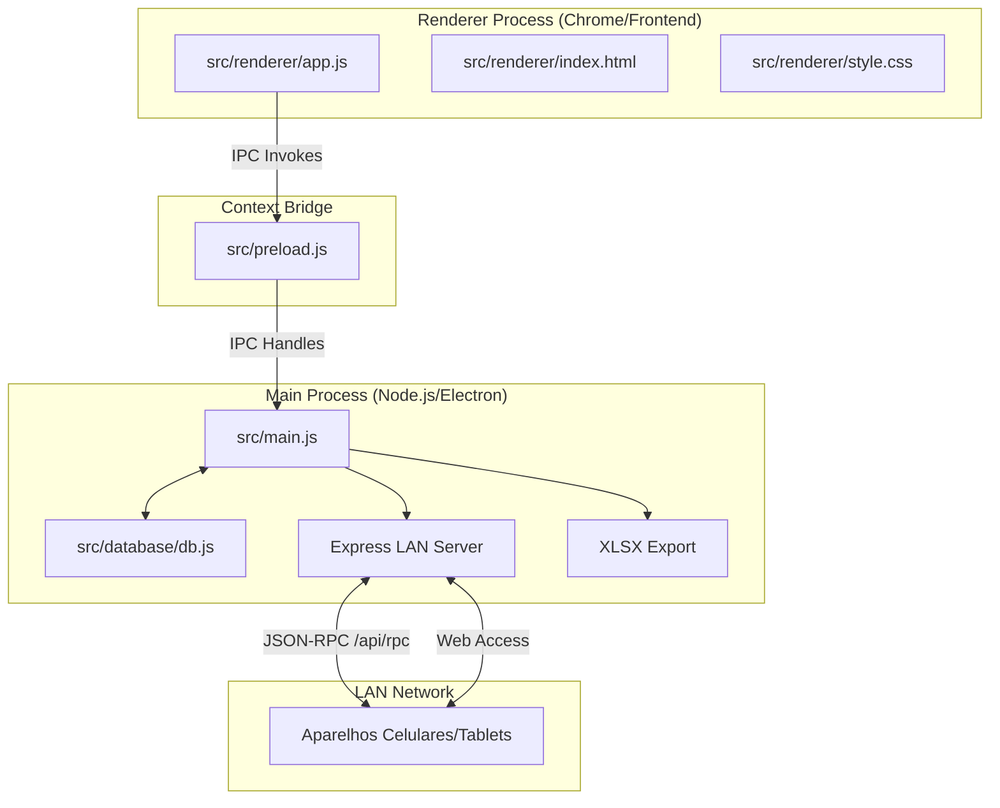
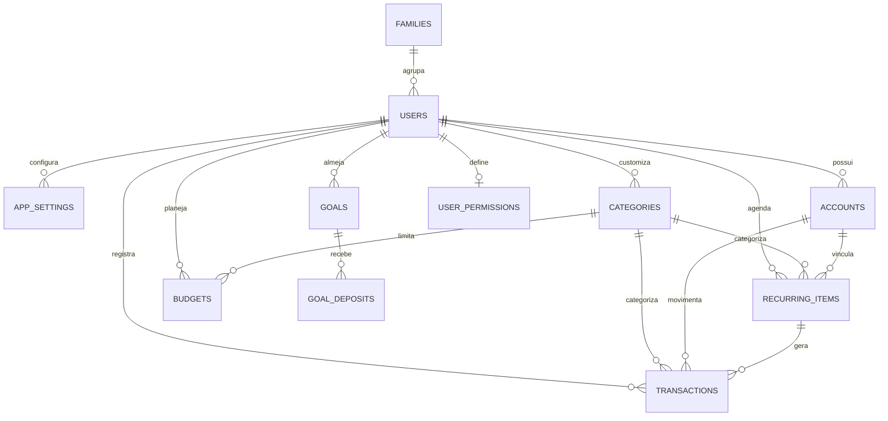

# FinançasFamília — Explicação Arquitetural e Funcional do Projeto

Este documento apresenta uma análise detalhada e profunda da estrutura, da arquitetura de software e dos fluxos lógicos do **FinançasFamília**, um aplicativo híbrido de controle financeiro pessoal e familiar. Ele foi desenvolvido sob a plataforma **Electron**, integrando um banco de dados relacional local, recursos avançados de sincronização de rede local (LAN), controle de permissões por perfil, além de um motor autolimpante de controle de recorrências mensais.

---

## 🌀 1. Visão Geral da Arquitetura

O sistema é construído sobre o modelo híbrido oferecido pelo **Electron**, separando de maneira rígida a interface com o usuário (Renderer Process) da orquestração do sistema operacional e acesso direto a recursos de hardware (Main Process).



### 1.1. Main Process (`src/main.js`)
Atua como o backend centralizado da aplicação. É executado em ambiente Node.js puro e suas principais atribuições incluem:
*   **Gerenciamento da Janela Principal (`BrowserWindow`)**: Inicializa uma janela sem bordas nativas (`frame: false`), injetando folhas de estilo personalizadas para controle manual de minimizar, maximizar e fechar.
*   **Servidor Web Local (LAN Server)**: Inicializa uma aplicação Express na porta `3000` ouvindo em todas as interfaces de rede (`0.0.0.0`). Isso permite que smartphones e tablets na mesma rede acessem a aplicação através do navegador e interajam em tempo real com o banco de dados.
*   **Barramento de Comunicação IPC (`ipcMain`)**: Registra de forma dinâmica todos os canais de comunicação com a interface, roteando as requisições para a classe de gerenciamento de dados.
*   **Exportação e Operações de E/S**: Responsável por exportar planilhas Excel avançadas multi-abas (`xlsx`) e gerar arquivos físicos de backup SQLite (`.db`).

### 1.2. Preload Script (`src/preload.js`)
Funciona como uma membrana de segurança e ponte bidirecional isolada (`contextIsolation: true`). Ele expõe APIs limitadas e seguras à camada gráfica por meio do `contextBridge.exposeInMainWorld('api', ...)`, garantindo que o frontend não tenha acesso irrestrito às APIs nativas do Node.js (evitando vulnerabilidades de RCE).

### 1.3. Renderer Process (`src/renderer/`)
A interface é uma Single Page Application (SPA) construída com tecnologias web padrão (Vanilla JS, HTML5 e CSS3), sem dependência de frameworks modernos (como React ou Vue), garantindo máxima velocidade de carregamento e renderização fluida.
*   **`index.html`**: Fornece a estrutura de marcação para as telas de login, o wizard de cadastro modular por etapas e os painéis de navegação das páginas dinâmicas.
*   **`style.css`**: Define a identidade visual e o design system do app, implementando uma paleta sofisticada com base em HSL, efeitos de vidro (glassmorphism), sombras flutuantes e animações de transição de estado.
*   **`app.js`**: Gerencia o estado reativo local (`State`), manipula os elementos do DOM, renderiza gráficos interativos usando a biblioteca **Chart.js** e gerencia o fallback de comunicação RPC para quando o app roda em dispositivos remotos (LAN) fora do invólucro do Electron.

---

## 🗄️ 2. Arquitetura do Banco de Dados (`src/database/db.js`)

A persistência utiliza o **SQLite** por meio do pacote de alta performance `better-sqlite3`. O banco de dados é inicializado em modo de gravação otimizada (WAL - *Write-Ahead Logging*) e com verificação estrita de chaves estrangeiras (`foreign_keys = ON`).



### 2.1. Descrição Crítica das Tabelas

1.  **`families`**: Armazena as organizações familiares. Centraliza a imposição de cotas de perfis (`quota_users` - padrão 6) e de contas bancárias (`quota_accounts` - padrão 10), garantindo o controle operacional do grupo familiar.
2.  **`users`**: Entidade central de identificação. Armazena dados cadastrais detalhados (Nome completo, Usuário, Email, Telefone, CPF e Data de Nascimento), as credenciais criptografadas via **bcryptjs** (`password_hash`), referências estéticas (`avatar_color` e `avatar_image`) e de privilégios (`profile_type` e `family_id`).
3.  **`app_settings`**: Armazena chaves-valor de configurações personalizadas dos usuários (como quantos dias de antecedência exibir alertas de vencimento próximo, `alert_days_before`).
4.  **`accounts`**: Contas e cartões dos usuários. Suporta categorias flexíveis (`checking` - Corrente, `savings` - Poupança, `wallet` - Carteira, `credit` - Cartão de Crédito, `investment` - Investimento e `voucher` - Vale Refeição/Alimentação). Mapeia as datas de fechamento e vencimento de faturas, limites de crédito e o banco emissor (com presets gráficos integrados).
5.  **`categories`**: Categorias financeiras de classificação. Contém registros padrões (sementes globais) e registros personalizados criados por usuários específicos, associando cores e ícones emoji.
6.  **`recurring_items`**: O coração do planejamento preventivo. Guarda as receitas ou despesas recorrentes programadas pelos usuários (aluguel, salário, assinaturas), com configurações de prioridade (`is_priority`), dia de vencimento, conta vinculada, parcelamento (`repeat_months` para parcelas fixas ou `0` para contínuas) e controle posicional na ordenação manual da tela.
7.  **`transactions`**: O histórico real de movimentação financeira. Registra receitas, despesas e transferências. Armazena o valor bruto, data da transação, sinalizadores de liquidação (`is_paid`) e se a transação é autônoma (`is_avulso = 1`), gerada de recorrência (`is_avulso = 0`), ou uma recorrência ignorada/descartada (`is_avulso = 2`).
8.  **`budgets`**: Tetos orçamentários definidos mês a mês para categorias específicas. Permite o cálculo preventivo do percentual consumido pela despesa real para evitar estouro de orçamento.
9.  **`goals`** & **`goal_deposits`**: Gerenciador de metas de economia. Permite projetar um valor alvo, data limite e fazer depósitos incrementais acumulando o progresso da conquista.
10. **`user_permissions`**: Nível de controle de acesso granular de cada usuário. Configura acessos aos menus centrais e se o usuário pode visualizar ou editar dados de outros familiares do mesmo grupo.
11. **`server_logs`**: Tabela de auditoria interna para monitoramento de eventos de login, cadastros e acessos ao servidor da rede local.

---

## ⚡ 3. Recursos de Destaque e Lógica de Negócios

### 3.1. O Motor Inteligente de Recorrências (`generateMonthlyRecurrences`)
Diferente de sistemas que calculam transações dinamicamente na renderização, o FinançasFamília utiliza um **motor autolimpante e resiliente de geração de transações recorrentes**. Quando o usuário acessa o dashboard ou planeja um período, o banco de dados executa a rotina `generateMonthlyRecurrences` para o mês/ano selecionado:

1.  **Validação de Vigência**: Identifica se a data de criação do item recorrente é igual ou inferior ao mês alvo do processamento.
2.  **Cálculo Automático de Parcelamento**: Se o item tiver um limite de parcelas (`repeat_months` > 0), ele calcula dinamicamente o número da parcela correspondente no período (`currentInstallment`). Se a parcela ultrapassar o teto estipulado, a geração é abortada para o período. Ele também deduz transações que foram puladas/ocultadas (`is_avulso = 2`) para manter a numeração das parcelas correta.
3.  **Geração com Auto-Healing**: Injeta no histórico (`transactions`) um lançamento com status de pagamento zerado (`is_paid = 0`) vinculado ao `recurring_item_id`. Caso a transação já exista, mas esteja pendente e sua descrição original divirja da descrição ideal (ex: mudança do nome do item no planejamento), o motor corrige de forma autônoma a nomenclatura (auto-healing).

### 3.2. Sincronização e Fallback de Rede Local (LAN Web Server)
A aplicação funciona nativamente em desktops através do Electron, mas expõe seu barramento completo para dispositivos móveis na mesma rede Wi-Fi.

```
+------------------------------------+
|  Electron Desktop (Main Node.js)   |
|  - Inicia Express na porta 3000    |
|  - Escuta em 0.0.0.0 (Toda a LAN)  |
|  - Gera QR Code com IP e Porta     |
+-----------------+------------------+
                  |
                  | [Wi-Fi Local]
                  v
+------------------------------------+
|  Dispositivo Móvel (Smartphone)   |
|  - Abre http://<IP>:3000           |
|  - Carrega index.html e app.js     |
|  - Fallback window.api: HTTP RPC    |
+------------------------------------+
```

*   **Identificação do Ambiente (Fallback RPC)**: No arquivo `app.js` (linhas 1 a 98), o frontend verifica a presença de `window.api`. Caso não esteja rodando dentro do contêiner do Electron, o script cria um proxy dinâmico. Todas as chamadas para `window.api.auth.login`, `window.api.transactions.getAll`, etc., são interceptadas e redirecionadas como requisições `POST` do tipo JSON-RPC para a rota `/api/rpc` do servidor local.
*   **Autonomia de Dispositivo**: O servidor Express serve os arquivos de frontend contidos na pasta `src/renderer/` como recursos estáticos públicos, garantindo que o celular navegue por uma interface idêntica e sem atrasos.

### 3.3. Perfis, Papéis e Permissões de Usuários
O sistema adota um padrão de classificação familiar estruturado em 4 níveis (mapeados na coluna `profile_type` da tabela `users`):

| ID | Nome do Perfil | Descrição e Acessos |
|:--:|:---|:---|
| **1** | **Administrador Geral** | Usuário mestre do sistema (padrão usuário `adm`). Pode gerenciar múltiplas famílias, redefinir cotas (`quota_users` e `quota_accounts`), inspecionar logs de servidor e reconfigurar qualquer perfil. |
| **2** | **Responsável** | Dono da família. Recebe controle pleno das finanças da sua organização. Pode editar, visualizar, excluir movimentações de seus dependentes e configurar permissões. |
| **3** | **Primogênito** | Membro colaborador padrão da família. Pode gerenciar seus próprios lançamentos, contas e metas. |
| **5** | **Caçula** | Perfil simplificado e gamificado. Projetado para crianças aprenderem educação financeira. Possui uma dashboard exclusiva simplificada (`renderCaculaDashboard`), com visualização de saldo focada em "mesada", metas lúdicas de poupança e interface sem jargões contábeis avançados. |

A segurança e sigilo entre membros são regidos pela tabela `user_permissions`, que define de forma granular se um usuário comum tem autorização de leitura global (`can_view_all`) ou edição global (`can_edit_all`) sobre as contas de outros membros da família.

---

## 🎨 4. Experiência do Usuário (UX) e Design Visual

A estética visual do FinançasFamília foi concebida sob os mais altos padrões de design moderno para aplicações desktop premium, baseando-se em:

### 4.1. Visual Premium e Fluidez
*   **Identidade Escura (Sleek Dark Mode)**: Fundo profundo e sofisticado (`#0a0d14`), que descansa a vista e cria contraste marcante com tons neons selecionados.
*   **Elementos Órbita (Glassmorphism Orbs)**: Presença de gradientes coloridos difusos animados em posições absolutas desfocadas atrás do formulário de acesso e wizard de cadastro, simulando um ambiente translúcido tridimensional e futurista.
*   **Typography e Micro-Animações**: Utilização da tipografia **Inter** de alta legibilidade, com transições suaves de opacidade (`transition: all 0.3s ease`) e pequenas animações de escalonamento em botões e abas para gerar sensação de reatividade a cada interação.

### 4.2. Vetores SVG Nativos de Alto Impacto
*   **Avatares Vetoriais**: A aplicação traz 12 avatares vetorizados complexos (injetados diretamente como tags `<svg>` inline), representando figuras familiares, cofrinhos, gráficos e escudos de segurança.
*   **Widget Financeiro de Cartões**: Exibe as contas de cartão de crédito e contas correntes no formato físico de cartões bancários virtuais estilizados. Estes cartões mostram a bandeira/emissor correspondente usando logomarcas vetorizadas elegantes de dezenas de instituições financeiras do Brasil (Nubank, Bradesco, Itaú, Banco do Brasil, Sicredi, XP, C6, etc.).
*   **Anéis de Progresso Donut**: Círculos de progresso desenhados sob demanda em SVG com cálculo vetorial dinâmico (`stroke-dasharray` e `stroke-dashoffset`) para ilustrar com clareza o consumo percentual dos orçamentos mensais e metas pendentes.

---

## 🔄 5. Fluxo de Execução Típico

Para ilustrar o comportamento dinâmico da aplicação, este é o caminho percorrido pelo sistema em uma operação diária:

```
[Cadastro Seguro (Wizard)] ──> [Login Rápido] ──> [Cálculo de Recorrências]
                                                        │
    ┌─────────────────┬─────────────────────────────────┤
    ▼                 ▼                                 ▼
[Dashboard]      [Transações / Contas]           [Exportação Relatório]
 - Carrega KPIs   - Cria despesas/receitas        - Gera arquivo Excel
 - Renders SVGs   - Efetua transferências         - Multi-abas formatadas
 - Chart.js plots  entre contas                   - Backup seguro .db
```

1.  **Acesso ou Registro**: O usuário é recebido pela tela de login premium. Caso não tenha conta, o **Signup Wizard** guia o usuário em 3 fases seguras (Pessoal -> Contato -> Acesso), calculando dinamicamente a força da senha em tempo real.
2.  **Autenticação**: Ao fazer o login, o Electron valida as credenciais contra a tabela de usuários via `bcryptjs`, carrega as permissões de acesso do usuário e redireciona para a janela principal da SPA.
3.  **Preparação de Dados**: O sistema executa a trigger interna de processamento de recorrências (`generateMonthlyRecurrences`) a fim de projetar as transações recorrentes previstas para o período atual.
4.  **Operações no Dashboard**:
    *   O backend calcula as somas brutas por meio de transações parametrizadas no SQLite e devolve os consolidados para receitas, despesas pagas, despesas pendentes e saldos.
    *   O frontend recebe as informações e plota os gráficos de barras e rosquinhas do **Chart.js**.
    *   Os cartões de crédito e débito são montados sob demanda em código HTML dinâmico, exibindo suas respectivas marcas bancárias e consumo real do limite disponível.
5.  **Exportação do Período**: Ao acionar a exportação, o processo principal do Electron aciona o pacote `xlsx`, lê todas as tabelas relevantes associadas à família daquele usuário no período solicitado e constrói uma pasta de trabalho Excel altamente legível e organizada em múltiplas planilhas temáticas.
