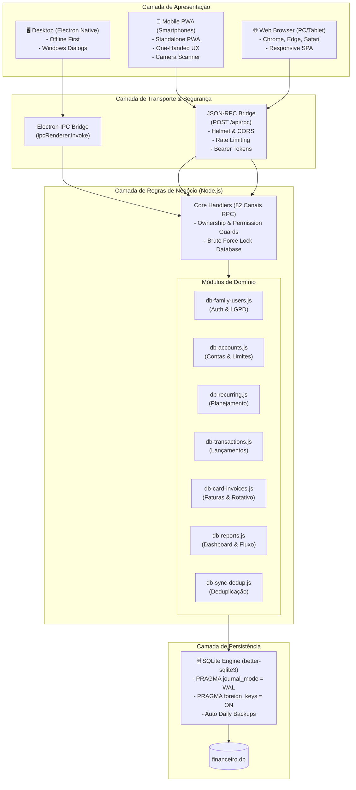

# 💰 FinançasFamília (MVP v1.0)

> **Plataforma Completa de Gestão Financeira Pessoal e Familiar.**
> Desenvolvida sob uma arquitetura híbrida de alta performance: **Desktop Offline-First (Electron + SQLite)**, **Web Server (Express + JSON-RPC)** e **Mobile PWA (Progressive Web App)** para smartphones Android e iOS.

---

## 📑 Índice
- [Visão Geral](#-visão-geral)
- [Os 3 Ambientes de Execução](#-os-3-ambientes-de-execução)
  - [1. Desktop Offline (Electron)](#1--desktop-offline-electron)
  - [2. Versão Web (Navegador & Nuvem)](#2--versão-web-navegador--nuvem)
  - [3. Versão Mobile (PWA - Progressive Web App)](#3--versão-mobile-pwa---progressive-web-app)
- [Sincronização em Rede Local (LAN Multi-Device)](#-sincronização-em-rede-local-lan-multi-device)
- [Módulos e Regras de Negócio](#-módulos-e-regras-de-negócio)
- [Diagrama de Arquitetura](#-diagrama-de-arquitetura)
- [Guia de Instalação e Uso](#-guia-de-instalação-e-uso)
  - [Como Rodar no Desktop](#como-rodar-no-desktop)
  - [Como Acessar e Instalar o PWA no Celular](#como-acessar-e-instalar-o-pwa-no-celular)
  - [Como Executar o Servidor Web Standalone](#como-executar-o-servidor-web-standalone)
  - [Deploy em Nuvem (Docker / Fly.io / Render)](#deploy-em-nuvem-docker--flyio--render)
- [Comandos e Scripts Disponíveis](#-comandos-e-scripts-disponíveis)
- [Estrutura de Pastas](#-estrutura-de-pastas)
- [Suíte de Testes Automatizados](#-suíte-de-testes-automatizados)
- [Segurança & LGPD](#-segurança--lgpd)

---

## 🌟 Visão Geral

O **FinançasFamília** é um ecossistema financeiro projetado para unificar o controle de receitas, despesas, cartões de crédito, contas bancárias, metas e planejamento de múltiplos membros de uma família.

Diferente de sistemas convencionais que exigem conexão constante com a nuvem, o FinançasFamília foi concebido com a filosofia **Offline-First e Autonomia de Dados**: você é o dono exclusivo do seu banco de dados, com velocidade instantânea no Desktop e acesso sem fios compartilhado para toda a família em casa pelo Wi-Fi ou na nuvem.

---

## 🖥️ Os 3 Ambientes de Execução

```
+-------------------------------------------------------------------------------+
|                             FINANÇASFAMÍLIA CORE                              |
|                          (SQLite WAL + Core Engine)                           |
+-----------------------+-------------------------------+-----------------------+
|  🖥️ DESKTOP OFFLINE   |      🌐 WEB NAVEGADOR         |   📱 MOBILE PWA (APP) |
|  - Electron Nativo    |      - Servidor Express       |   - Instalável no SO  |
|  - 100% Sem Internet  |      - JSON-RPC Seguro        |   - One-Handed UX     |
|  - IPC Direto         |      - Sessões Bearer         |   - Scanner Câmera    |
|  - Diálogos Windows   |      - Docker / Fly.io        |   - Carrossel Cartões |
+-----------------------+-------------------------------+-----------------------+
```

### 1. 🖥️ Desktop Offline (Electron)
- **100% Offline-First:** Opera de maneira autônoma, sem necessidade de internet ou rede externa. Toda a lógica roda localmente via chamadas IPC (*Inter-Process Communication*).
- **Desempenho Extremo:** Banco de dados **SQLite** embutido em C++ (`better-sqlite3`) gravado diretamente no disco em `%APPDATA%\financeiro-familiar\financeiro.db`.
- **Janela Moderna & Frameless:** Barra de título personalizada em tema escuro esmeralda (*dark glassmorphic*), controle de minimizar/maximizar e suporte a atalhos de teclado.
- **Exportações Nativas do Sistema:** Integração direta com caixas de diálogo do Windows para exportar:
  - Banco de Dados SQLite completo (`.db`)
  - Relatórios Mensais e Anuais em Excel (`.xlsx`)
  - Extratos formatados em CSV (`.csv`)
  - Backups integrais em JSON (`.json`)

---

### 2. 🌐 Versão Web (Navegador & Nuvem)
- **Acesso Universal:** Compatível com qualquer navegador web moderno (Chrome, Edge, Firefox, Safari) em computadores, tablets ou smartphones.
- **Barramento JSON-RPC Robusto:** Rota unificada `/api/rpc` com 82 canais mapeados em paridade estrita 1:1 com os comandos do Desktop.
- **Segurança Reforçada:**
  - Autenticação por tokens de sessão assinados com criptografia SHA-256 (`crypto.randomBytes`).
  - Proteção de cabeçalhos via **Helmet** com políticas de isolamento de origem.
  - Mitigação de ataques de força bruta com **Rate Limiting** dinâmico e bloqueio temporário de usuário após tentativas incorretas.
  - Controle granular de CORS para conexões locais (LAN) e domínios em nuvem.
- **Downloads no Navegador:** Sistema automático de geração e download de arquivos Excel/CSV/JSON direto pela interface web via Base64.
- **Deploy Pronto para Nuvem:** Configurações prontas para **Docker**, **Fly.io** (`fly.toml` com volume persistente `/data`) e **Render** (`render.yaml`).

---

### 3. 📱 Versão Mobile (PWA - Progressive Web App)
- **Aplicativo Instalável:** Funciona como um aplicativo nativo no celular (Android e iOS) através do manifesto PWA (`manifest.json` com ícones de 192px e 512px, modo `standalone` e tema `#0a0d14`).
- **Sem Barra de Navegador:** Ao ser adicionado à tela inicial, abre em tela cheia idêntico a um app nativo baixado da loja.
- **Design Otimizado para Uma Só Mão (*Thumb Zone*):**
  - **Alternador Rápido de Meses:** `‹ Ago 2026 ›` no topo, permitindo navegar entre meses com o polegar.
  - **Hero Card Consolidado:** Saldo do mês em destaque grande, patrimônio líquido em contas e resumo direto de receitas e despesas.
  - **Lançamentos em 1 Toque:** Botões táteis destacados:
    - 💸 **+ Despesa** (Lançamento imediato ou direto no cartão de crédito)
    - 💰 **+ Receita**
    - 📷 **Scanner Inteligente** (Câmera ao vivo para ler Cupom Fiscal NFC-e, QR Code PIX e PDF da nota)
- **Carrossel Horizontal de Cartões (Estilo Apple Wallet / Nubank):**
  - Deslize lateral com *scroll-snap*.
  - Identificação visual e gradientes personalizados por banco (💜 Nubank, 💙 Banrisul, 🔴 Carrefour, 💛 Mercado Pago).
  - Limite disponível em destaque grande e barra de progresso colorida (% de uso da fatura).
- **Extrato Mobile Inteligente:** Lista de lançamentos compacta com tags de status (`✓ Pago` / `⏳ Aberto`) e botão de **Pagar** em 1 clique.

---

## 🌀 Sincronização em Rede Local (LAN Multi-Device)

O FinançasFamília resolve o problema do controle compartilhado sem cobrar mensalidades na nuvem:

```
                  [ 💻 PC Desktop ]
             (Electron + Servidor LAN :3000)
             (Banco SQLite: financeiro.db)
                          ▲
            ┌─────────────┴─────────────┐
            ▼                           ▼
    [ 📱 Celular 1 ]            [ 📱 Celular 2 ]
  (PWA / Wi-Fi da Casa)       (PWA / Wi-Fi da Casa)
```

1. Ao abrir o aplicativo no computador, o servidor Express integrado é iniciado automaticamente na porta `3000`.
2. Os membros da família conectam seus celulares na mesma rede Wi-Fi e acessam o endereço:
   `http://<IP_DO_COMPUTADOR>:3000` *(Ex: `http://192.168.1.7:3000`)*.
3. Graças ao modo **SQLite WAL (Write-Ahead Logging)**, múltiplos celulares e o Desktop podem ler e registrar compras simultaneamente sem travamento de arquivo (*database is locked*).
4. Um lançamento feito no celular aparece **no mesmo instante** na tela do computador.

---

## 📦 Módulos e Regras de Negócio

### 📊 1. Dashboard Financeiro & Indicadores
- Resumo mensal consolidado: Receitas, Despesas, Saldo Líquido e Patrimônio em Contas.
- Gráficos visuais com **Chart.js**: Fluxo de entradas vs saídas e distribuição percentual por categoria.
- Alertas visuais de contas próximas do vencimento configuráveis pelo usuário.

### 📋 2. Planejamento & Contas Recorrentes
- Cadastro de despesas e receitas fixas com dia de vencimento.
- **Ordenação Personalizada:** Reorganização de prioridade via *Drag and Drop* (arrastar e soltar).
- **Destaque de Prioridade:** Marcar contas essenciais com estrela ⭐.
- **Adiamento de Parcelas:** Recurso para adiar compromissos para o mês seguinte com recálculo automático.
- Geração inteligente mês a mês sem duplicação de dados históricos.

### 💳 3. Cartões de Crédito & Gestão de Faturas
- Ciclo completo de faturas: Aberta, Fechada, Paga e Renegociada.
- Controle dinâmico de **Limite Total**, **Limite Comprometido** (compras parceladas) e **Limite Disponível**.
- Suporte a **Pagamento Parcial de Fatura**: o valor restante é transferido automaticamente como crédito rotativo para a fatura do mês seguinte com aplicação de encargos.

### 🏦 4. Contas Bancárias, Carteiras e Vouchers
- Suporte a múltiplos tipos de conta: Corrente, Poupança, Investimentos, Dinheiro Físico (Carteira) e Vouchers (Refeição/Alimentação).
- Transferências instantâneas entre contas da mesma família com atualização de saldo em lote.

### 📷 5. Scanner Inteligente (NFC-e / PIX / PDF)
- **Leitura via Câmera:** Decodificação de QR Codes de Cupom Fiscal Eletrônico (NFC-e / SAT).
- **Leitura de Boletos:** Reconhecimento automático de linha digitável de 47/48 dígitos.
- **PIX Copia e Cola:** Extração automática de chave, valor e destinatário.
- **Upload de Fotos & PDFs:** Arraste a foto da nota ou a fatura em PDF para preenchimento automático.

### 📅 6. Calendário com Feriados Nacionais e Regras Financeiras
- **Prorrogação Bancária:** Se uma conta vencer em sábado, domingo ou feriado nacional, o sistema calcula o próximo dia útil financeiro automaticamente.
- **Feriados Móveis e Fixos:** Base integrada de feriados brasileiros (Carnaval, Sexta-feira Santa, Páscoa, Corpus Christi, Tiradentes, Natal, etc.).
- **Juros e Multas Moratórias:** Cálculo automático *pro-rata die* (% ao dia ou % ao mês + multa fixa) ao quitar contas com atraso.

### 🎯 7. Orçamentos & Metas
- Definição de tetos de gastos mensais por categoria com barra visual de consumo.
- Metas financeiras de médio e longo prazo com histórico de aportes e projeção de conclusão.

### 📥 8. Importador Bancário & Deduplicação
- Importação de arquivos de extrato bancário nos formatos **OFX** e **CSV**.
- Motor inteligente de **Deduplicação de Lançamentos** para evitar registrar duas vezes a mesma compra.

---

## 🏗️ Diagrama de Arquitetura



---

## 🚀 Guia de Instalação e Uso

### Pré-requisitos
- **Node.js** (versão 18.x ou 20.x recomendada)
- **npm**

### 1. Clonar o Repositório e Instalar
```bash
git clone https://github.com/naiffnet/familyfinancas.git
cd familyfinancas
npm install
```

---

### Como Rodar no Desktop
Para abrir a janela do aplicativo nativo:
```bash
npm start
```
*(Ou `npm run dev` para modo de desenvolvimento)*

---

### Como Acessar e Instalar o PWA no Celular

1. Com o app aberto no seu computador, certifique-se de que o celular está conectado na **mesma rede Wi-Fi**.
2. No celular, abra o navegador (Chrome ou Safari) e acesse:
   ```
   http://<IP_DO_SEU_PC>:3000
   ```
   *(Exemplo: `http://192.168.1.7:3000`)*
3. **Instalando como Aplicativo (PWA):**
   - **Android (Chrome):** Toque nos 3 pontinhos no canto superior direito e selecione **"Adicionar à tela inicial"** ou **"Instalar aplicativo"**.
   - **iPhone / iOS (Safari):** Toque no botão de Compartilhar (ícone com quadrado e seta) e selecione **"Adicionar à Tela de Início"**.
4. Um ícone do **FinançasFamília** aparecerá na tela inicial do seu celular, abrindo em tela cheia sem barra de endereço!

---

### Como Executar o Servidor Web Standalone
Caso queira rodar o servidor em um Raspberry Pi, servidor doméstico ou VPS sem interface gráfica:
```bash
npm run start:server
```

---

### Deploy em Nuvem (Docker / Fly.io / Render)

#### Usando Docker:
```bash
# Construir a imagem Docker
docker build -t financas-familia .

# Executar o container mapeando a porta 3000 e volume de dados
docker run -d -p 3000:3000 -v financas_data:/data financas-familia
```

#### Usando Fly.io:
O projeto já inclui o arquivo [`fly.toml`](file:///x:/Programas/MEUS%20APPs/app.financeiro/fly.toml) configurado para a região de São Paulo (`gru`) com volume persistente:
```bash
fly launch
fly deploy
```

---

## 🛠️ Comandos e Scripts Disponíveis

| Comando | Descrição |
| :--- | :--- |
| `npm start` | Inicia o aplicativo Desktop com o servidor LAN embutido |
| `npm run dev` | Inicia o Desktop em modo de desenvolvimento |
| `npm run build:renderer` | Compila e agrupa os módulos JS e CSS em `app.bundle.js` e `style.css` |
| `npm run watch:renderer` | Observa alterações em arquivos e recompila o bundle automaticamente |
| `npm test` | Executa a suíte completa de testes automatizados (7 suítes de teste) |
| `npm run rebuild` | Recompila bibliotecas nativas C++ para a versão do Electron instalada |
| `npm run start:server` | Inicia o servidor Web standalone em Node.js (sem abrir janela do Desktop) |

---

## 📂 Estrutura de Pastas

```text
├── src/
│   ├── database/                  # Mixins de Domínio SQLite (<1000 linhas)
│   │   ├── db-core.js             # Inicialização, WAL, Schemas e Auto Backup
│   │   ├── db-accounts.js         # Contas Correntes, Poupanças e Limites
│   │   ├── db-recurring.js        # Planejamento, Recorrências e Ordenação
│   │   ├── db-transactions.js     # Lançamentos, Liquidação Líquida e Extrato
│   │   ├── db-card-invoices.js    # Faturas, Fechamento de Ciclo e Rotativo
│   │   ├── db-reports.js          # Resumos, Fluxo de Caixa e Patrimônio
│   │   ├── db-sync-dedup.js       # Deduplicação e Sincronização
│   │   └── db-family-users.js     # Famílias, Perfis e Permissões
│   │
│   ├── server/                    # Servidor Express & Roteador RPC
│   │   └── core.js                # Handlers 1:1, Helmet, Rate Limiter e CORS
│   │
│   ├── renderer/                  # Interface Gráfica SPA (Vanilla CSS + JS)
│   │   ├── app.html               # Documento base HTML5 SPA
│   │   ├── manifest.json          # Manifesto do PWA Mobile
│   │   ├── style.css              # Estilos consolidados da aplicação
│   │   ├── app.bundle.js          # Bundle compilado do frontend
│   │   ├── css/                   # Folhas de estilo modulares
│   │   │   ├── base.css           # Variáveis de cor, tipografia e reset
│   │   │   ├── components.css     # Modais, botões, formulários e cards
│   │   │   ├── views.css          # Telas de dashboard, planejamento e contas
│   │   │   ├── responsive-features.css # Breakpoints para tablets e notebooks
│   │   │   └── mobile-environment.css  # Estilos específicos do PWA Mobile
│   │   └── js/modules/            # Módulos JavaScript (<1000 linhas)
│   │       ├── app-entry.js       # Ordem de injeção dos módulos
│   │       ├── mobile-dashboard.js# Dashboard Mobile Lean (Hero Card & Ações)
│   │       ├── mobile-shell.js    # Shell responsivo e barra de navegação
│   │       ├── nfce-scanner.js    # Leitor de Notas Fiscais e QR Code Câmera
│   │       ├── payment-modal.js   # Modal de Liquidação / QR Code PIX
│   │       ├── rpc-bridge.js      # Ponte JSON-RPC para Web e Celular
│   │       └── auth.js            # Wizard de Cadastro, Login e LGPD
│   │
│   ├── main.js                    # Processo Principal Electron
│   └── preload.js                 # Ponte Segura Desktop IPC
│
├── tests/                         # Testes Automatizados (TAP / Node.js)
│   ├── audit-logs.test.js         # Trilha de auditoria e logs
│   ├── billing-cycle.test.js      # Fechamento e ciclo de cartões
│   ├── card-advanced.test.js      # Rotativo, limites e estornos
│   ├── db-integrity.test.js       # Constraints, WAL e foreign keys
│   ├── holidays-business-days.test.js # Feriados e prorrogação útil
│   ├── interest-calc.test.js      # Juros e multas pro-rata
│   └── transactions-balance.test.js # Liquidação e saldo bancário
│
├── scripts/                       # Utilitários de Build e Concatenação
│   ├── concat-modules.js          # Compilador de módulos do frontend
│   └── run-tests.js               # Executor da suíte de testes
│
├── Dockerfile                     # Container de produção
├── fly.toml                       # Configuração para deploy no Fly.io
├── render.yaml                    # Configuração para deploy no Render
└── package.json
```

---

## 🧪 Suíte de Testes Automatizados

O sistema conta com **7 suítes de testes de integração automatizados** que cobrem as regras financeiras mais críticas:

1. **Trilha de Auditoria (`audit-logs.test.js`):** Registra histórico de criação, alteração e exclusão de contas e lançamentos.
2. **Ciclo de Cartão de Crédito (`billing-cycle.test.js`):** Valida datas de fechamento e virada de ano em faturas.
3. **Rotativo & Estornos (`card-advanced.test.js`):** Testa pagamento parcial de fatura e restauração de saldo em estornos.
4. **Integridade SQLite (`db-integrity.test.js`):** Valida modo WAL, Foreign Keys ativas e constraints CHECK de tipo de conta.
5. **Feriados e Prorrogação (`holidays-business-days.test.js`):** Testa feriados fixos e móveis com prorrogação automática para o próximo dia útil.
6. **Cálculo de Juros e Multas (`interest-calc.test.js`):** Valida precisão de juros diários (% a.d.) e mensais *pro-rata die*.
7. **Lançamentos e Saldo Bancário (`transactions-balance.test.js`):** Testa liquidação à vista, liquidação líquida e restauração de saldo na exclusão.

Para rodar todos os testes:
```bash
npm test
```

---

## 🛡️ Segurança & LGPD

- **Em Conformidade com a LGPD (Lei nº 13.709/2018):** Termos de Uso e Política de Privacidade integrados no fluxo de cadastro.
- **Armazenamento Seguro:** Senhas criptografadas com hash irreversível `bcryptjs` (salt rounds).
- **Recuperação Descentralizada:** Pergunta de segurança secreta para redefinição de senha sem dependência de envio de e-mails para servidores de terceiros.
- **Auditoria Interna:** Todas as ações de exclusão ou edição registram logs internos imutáveis vinculados à família do usuário.

---

## 📄 Licença

Projeto desenvolvido por **William Naiff**. Todos os direitos reservados.
