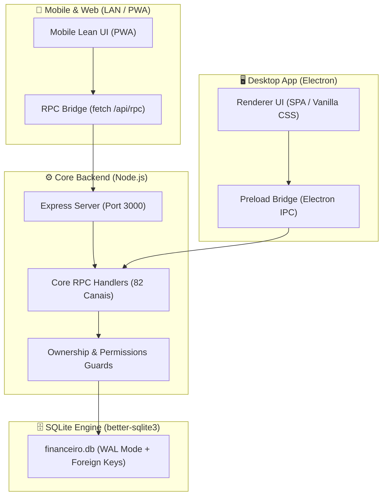

# 💰 FinançasFamília (MVP v1.0)

> Plataforma híbrida premium de **Gestão Financeira Pessoal e Familiar**. Desenvolvida para operar de forma nativa e **100% offline no Desktop (Electron + SQLite)**, com sincronização em tempo real via **Rede Local (LAN)** para dispositivos **Mobile (Smartphones / PWA)** e navegadores web.

---

## 🌟 Destaques do MVP

### 🖥️ 1. Desktop Nativo (Offline-First)
- **Zero Dependência Externa:** Funciona 100% sem conexão com a internet através do motor embutido em C++ **SQLite** (`better-sqlite3`).
- **Janela Moderna & Frameless:** Interface dark glassmorphic com tema esmeralda, cabeçalho limpo e alternância de temas.
- **Exportações Nativas:** Integração com caixas de diálogo do Windows para exportar banco `.db`, relatórios em Excel `.xlsx`, extratos `.csv` e backups em `.json`.

### 📱 2. Experiência Mobile Enxuta (One-Handed UX)
- **Top Bar Minimalista:** Navegador de meses ultra-rápido (`‹ Ago 2026 ›`).
- **Hero Card com Saldo Consolidado:** Patrimônio líquido em contas, receitas (+), despesas (-) e saldo operacional.
- **Lançamentos em 1 Toque:** Botões táteis de ação rápida:
  - 💸 **+ Despesa** (Lançamento imediato ou no cartão)
  - 💰 **+ Receita**
  - 📷 **Scanner Inteligente** (Leitor de Cupom Fiscal NFC-e, QR Code PIX e PDF via câmera ou upload)
- **Carrossel Horizontal de Cartões:** Visualização estilo *Apple Wallet / Nubank* com limites disponíveis em destaque grande e barra de progresso visual de uso da fatura.
- **Extrato Tátil com Quitação Rápida:** Botão **Pagar** em 1 clique com cálculo automático de descontos, juros e multas.

### 💳 3. Motor Financeiro & Regras de Negócio Avançadas
- **Cartões de Crédito & Faturas:** Fechamento automático de ciclo de faturas, controle de limite comprometido vs disponível, pagamento parcial com saldo rotativo e encargos.
- **Calendário Inteligente de Vencimentos:** Prorrogação automática de vencimentos que caem em fins de semana e feriados nacionais móveis/fixos (Páscoa, Tiradentes, Natal, etc.).
- **Juros e Multas Moratórias:** Cálculo automático *pro-rata die* ao liquidar despesas atrasadas.
- **Planejamento Recorrente:** Projeção mensal de contas fixas com ordenação por prioridade e funcionalidade de adiar parcelas.

### 🛡️ 4. Segurança, LGPD & Isolamento Multi-Família
- **Wizard de Cadastro Familiar:** Cadastro guiado em 3 etapas com aceite de Termos de Uso e Política de Privacidade (LGPD).
- **Recuperação de Acesso:** Pergunta e resposta secreta de segurança para recuperação de senha sem depender de provedores de e-mail externos.
- **Isolamento de Dados:** Cada família possui seu espaço restrito com permissões granulares por membro (exibir tudo, editar tudo, ocultar abas).

---

## 🏗️ Arquitetura do Sistema



---

## 🚀 Como Executar o Projeto

### Pré-requisitos
- **Node.js** (v18 ou superior)
- **npm**

### 1. Instalação
```bash
# Clonar o repositório
git clone https://github.com/naiffnet/familyfinancas.git
cd familyfinancas

# Instalar dependências
npm install
```

### 2. Executar no Desktop (Electron)
```bash
npm start
```
*Ou `npm run dev`.*

### 3. Acessar pelo Celular / Rede Local (LAN)
Com o aplicativo aberto no Desktop, conecte o celular no mesmo Wi-Fi e acesse pelo navegador:
```
http://<SEU_IP_LOCAL>:3000
```
*(Exemplo: `http://192.168.1.7:3000`)*

---

## 🧪 Scripts e Ferramentas

| Comando | Descrição |
| :--- | :--- |
| `npm start` | Inicia o aplicativo Desktop com o servidor de rede local embutido |
| `npm run build:renderer` | Concatena e empacota os módulos frontend em `app.bundle.js` e `style.css` |
| `npm run watch:renderer` | Modo de desenvolvimento contínuo (recompila o bundle ao salvar) |
| `npm test` | Executa a suíte completa de testes automatizados (7 suítes de teste) |
| `npm run rebuild` | Recompila o `better-sqlite3` para a versão atual do Electron |
| `npm run start:server` | Inicia somente o servidor web standalone em Node.js (sem abrir janela Electron) |

---

## 📂 Estrutura de Diretórios

```text
├── src/
│   ├── database/               # Camada de Dados Modularizada (Mixins SQLite)
│   │   ├── db-core.js          # Inicialização, Schemas, Migrations e Backups
│   │   ├── db-accounts.js      # Gestão de Contas e Limites de Cartão
│   │   ├── db-recurring.js     # Planejamento, Recorrências e Ordenação
│   │   ├── db-transactions.js  # Lançamentos, Liquidações e Extratos
│   │   ├── db-card-invoices.js # Ciclos de Fatura, Fechamento e Rotativo
│   │   ├── db-reports.js       # Dashboards, Fluxo de Caixa e Patrimônio
│   │   ├── db-sync-dedup.js    # Sincronização e Deduplicação Inteligente
│   │   └── db-family-users.js  # Perfis, Famílias e Permissões
│   │
│   ├── server/                 # Servidor Express & Barramento RPC
│   │   └── core.js             # Handlers RPC 1:1, Helmet, Rate Limiter e CORS
│   │
│   ├── renderer/               # Frontend SPA (Vanilla JS + CSS)
│   │   ├── app.html            # Estrutura base da SPA
│   │   ├── style.css           # Folha de estilos consolidada
│   │   ├── app.bundle.js       # Bundle compilado de scripts
│   │   ├── css/                # Folhas de estilo modulares
│   │   └── js/modules/         # Módulos JS limpos (<1000 linhas)
│   │
│   ├── main.js                 # Processo Principal do Electron
│   └── preload.js              # Ponte de Segurança IPC Desktop
│
├── tests/                      # Bateria de Testes Automatizados (TAP)
├── scripts/                    # Scripts de Build, Concatenação e Testes
└── package.json
```

---

## 📄 Licença e Termos

Este software é protegido por direitos autorais e regulado pelos Termos de Uso e Política de Privacidade em conformidade com a LGPD (Lei nº 13.709/2018).
